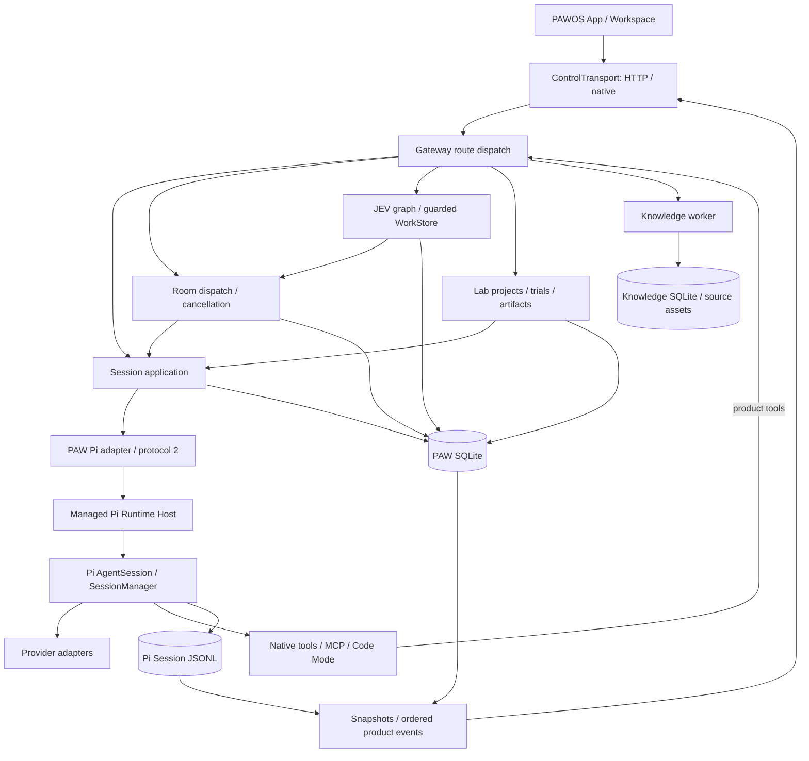
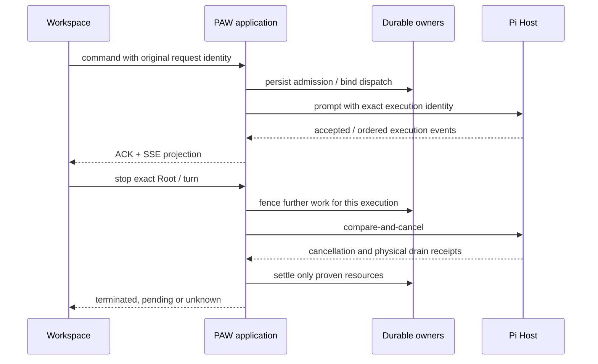

# PAW 与 Pi 的状态和扩展边界

本文说明源码中的职责与恢复路径。构建通过、测试夹具通过和已安装产品验收是不同证据；源码文档不表示当前安装已经升级。

## 模块与入口

| Concern | Owner and entry | What it does not own |
| --- | --- | --- |
| Product composition | `control-center-web/src/app/App.tsx`, `register-extension-hosts.ts` | Agent scheduling or a second page/router implementation |
| Desktop and windows | `src/paw-os/PawOsApp.tsx`, app registry and workspace components | Execution completion; closing a window does not stop a task |
| Session interaction | `src/features/agent/runtime/use-agent-live-session.ts`, `state/live-store.ts` | Durable transcript or authorization |
| Room command delivery | `src/features/rooms/application/room-send.ts`, `runtime/room-send-journal.ts` | Model/Tool loops or Root completion |
| JEV command delivery | `src/features/semantic-workspace/jev-command-journal.ts`, admission/plan/assignment/revision adapters | Business receipt validation or a second task scheduler |
| Room projection | `src/features/rooms/runtime/shared-room-live-session.ts`, `src/features/rooms/state/live-store.ts`, `src/contracts/room-reducer.ts` | Automatic resubmission of an uncertain command |
| HTTP/native transport | `src/platform`, `rag_ime/control_api`, `rag_ime/debug_server.py` | Business scheduling; route descriptors select existing application owners |
| Session application | `rag_ime/agent_service.py`, Session application services and `agent_sessions.py` | Pi's model loop and compaction implementation |
| Collaboration | `rag_ime/rooms/session_dispatch.py`, `turn_registry.py`, `session_cancellation.py` | A replacement Pi Session or a second per-tool approval |
| JEV | `rag_ime/jev_tasks/application.py`, `owner.py`, `ledger.py`, `effects.py` | Unbounded executable model decisions; choices operate on host-validated tasks |
| Lab | `rag_ime/agent_lab/project_application.py`, `trials.py`, `trial_execution.py` | A second Agent loop; adapters bind to existing execution owners |
| Knowledge and RAG | `rag_ime/knowledge_library` | Personal Memory governance or Session lifecycle |
| Memory | Governed Memory stores, maintenance settings and `memory_model_executor.py` | Raw input as accepted facts; model output alone does not establish durable truth |
| Pi integration | `rag_ime/pi/factory.py`, `host_client.py`, `runtime.py`, `transcript.py` | Package installation/activation or a second Tool engine |
| Plugin packages | `rag_ime/agent_extensions.py` and Pi `NativePiPackageManager` | Session execution authority or durable approval inferred from a preview |
| Product Sandbox | `rag_ime/vertical_sandbox_connector.py` | Code Mode or arbitrary execution outside the allowlisted suite |
| Installation | `rag_ime/managed_pi_runtime.py`, `scripts/build_managed_pi_runtime_v2.py` | Automatic activation of a development payload |

Frontend paths beginning with `src/` are relative to `control-center-web/`.
See the narrower [Pi](rag_ime/pi/README.md), [Lab](rag_ime/agent_lab/README.md),
[Knowledge](rag_ime/knowledge_library/README.md) and [JEV](integrations/jev/README.md) maps before editing an owner.

## Frontend composition and reading ownership

The desktop store is the only window-state implementation. The retired desktop
reducer and Earth GIS model were disconnected alternatives; Earth keeps its live
map-selection owner. `ThemeProvider` retains the persisted light/dark/system
preference, while the single blueprint appearance is a root attribute, not a
second store or a no-op provider.

`PawAgentApp` loads the selected Room or Session workspace through separate lazy
boundaries. Existing workspace props and callbacks keep their ownership; switching
views does not create another execution store. `PawWindowLayer` loads background
Tool observers only when the existing activation policy needs them. Once active,
the observer retains real receipt validation and running-job observation after
focus leaves the Agent; closing a window is not cancellation.

`PawRoomRoundSheet` owns reading intent, not execution state. Following the latest
round survives streamed content growth and viewport resize. An explicit history
read or disclosure interaction releases follow; returning to latest opts in again.
One lifecycle-scoped resize observer measures the viewport and round layout, and
is disconnected on cleanup. Layout-driven scroll events do not impersonate a
reader choosing history. Navigation keeps the latest round reachable horizontally.

Room activity summaries share one display fallback in `roomActivityPublicSummary`.
Exact event enums receive readable labels, while diagnostic text and stored source
evidence remain unchanged. The task sheet consumes this presentation at its
activity-to-row boundary rather than maintaining another mapping.

## State authority and recovery

| State | Writer and persistence | Recovery rule |
| --- | --- | --- |
| Draft, selected tab, reading position | Workspace UI state | Restore interaction state without issuing a model request |
| Unconfirmed Room send | Shared send journal, scoped to connection and Room | Explicit retry keeps the original identity and original payload |
| Unconfirmed JEV command | One command journal implementation, scoped to connection and operation/Room/task | Freeze the original input; join a live request on remount; restore an unknown outcome after reload without automatic replay |
| UI execution projection | Shared live store, fed by ACK/snapshot/SSE | Resnapshot after a gap; never treat a visible message or old cache as execution authority |
| Session identity/configuration | `AgentSessionStore`, PAW SQLite | Reopen the stored binding; preserve existing transcripts and explicit settings |
| Session transcript and branch | Pi `SessionManager`, JSONL | Host reopens the branch; PAW's recent-message cache is disposable acceleration |
| Active execution | Pi Host turn identity and PAW runtime binding | Compare exact identities before cancel/settle; idle alone is not a historical completion receipt |
| Room membership and public events | Room store, PAW SQLite | Rebuild projections from ordered events and exact Root/dispatch bindings |
| Current in-process Room dispatch | `RoomTurnRegistry` | Locks fence begin/cancel/finish; durable application receipts support restart reconciliation |
| JEV task assignment and outcome | Canonical WorkStore with `GuardedWorkOwner`/`GraphLedger` on the same SQLite DB | Revalidate assignment, attempt, Root epoch and requirements before accepting a mutation |
| JEV external dispatch/cancel | `RuntimeEffects` persistent outbox | `pending` may send once; `sending`/`unknown` must look up the original effect, not send again |
| Tool approval/execution claim | `AgentApprovalApplicationService` and `AgentSessionStore` | Claimed-but-unsettled work is unknown; repair projections without replaying effects |
| Gateway request identity | `GatewayRequestStore`, PAW SQLite | Exact completed repeats return the saved reply; changed intent conflicts and unknown outcomes cannot execute again |
| Background process | `AgentBackgroundJobService` and process identity records | Reattach only when process identity is proven; preserve request idempotency |
| Lab trial | `AgentLabTrialStore` and one `AgentLabTrialApplication` | Restart makes unsettled jobs interrupted; replaying admission does not rerun the adapter |
| Lab artifact/App version | Project/artifact/App stores plus frozen selected files | Read the bound version and evidence; an unavailable execution read does not erase its binding |
| Knowledge document/index | `KnowledgeStore` and worker SQLite: current document revisions, replaceable chunks/indexes and hash-addressed assets | Revision checks fence stale jobs; reindexing replaces old chunks. Historical evidence requires a frozen snapshot |
| Plugin installation/configuration | PAW `AgentExtensionService` owns approval/verification; Pi `NativePiPackageManager` owns managed contents, `native-packages.json` and SettingsManager package configuration | Enabled capability inventory is restored from configuration. Preview tokens are process-local and do not restore approval authority |
| Sandbox suite execution | `VerticalSandboxConnectorService`, Trace/Eval/SandboxRun records | The Pi Package routes to allowlisted suite execution and process isolation; a Tool reply cannot replace the persisted run result |
| Model choice | Current configuration and per-Session/per-run binding | New defaults and frozen historical model identity are separate; never relabel old receipts |

Multiple projections are necessary: the browser needs a bounded view, PAW needs
product state, and Pi needs its transcript. They are not interchangeable writable
copies. A projection cannot admit execution, approve a Tool, or complete a Root.

## Send, stop and uncertain effects

Admission, a successful Tool effect, a delivered Tool reply, and a completed
Root are four facts. A network error proves none of their opposites. Recovery
queries the original binding/receipt and preserves unknown outcomes. A new
request ID is a new operation, not a safe recovery mechanism.

JEV admission, plan decisions, task assignment and task revision share request
identity, immutable pending input and persistence mechanics. Their adapters
retain distinct input/receipt validation and definitive-rejection rules. An
acknowledged request can release its journal slot before an old retry settles;
only the entry that still owns that slot may clear or replace it. Transports
with the same connection identity share a live promise. Anonymous transports
remain separate, and a full page reload restores an uncertain command rather
than pretending it still observes a promise. The four existing `sessionStorage`
v1 keys and saved admission shape remain readable in both directions; no user
data migration is required. Browser persistence is best effort when disabled.

Foreground Gateway shell commands have a separate physical owner,
`WorkspaceCommandOwner`, because cancelling the Pi HTTP client cannot kill a
Python-owned subprocess. Its call scope signals the command and reports whether
it drained. The aggregate Room cancellation proof includes these resources as
well as Pi's operations. Cancellation must also fence calls that have not yet
entered this owner; exact admission identity is part of that boundary.

The Pi bridge captures turn/message and Room capability before waiting for HTTP
capacity. PAW validates that binding. The cancellation owner persists exact-turn Stop
markers before waiting for the Host; approval claims atomically check those
markers before execution. Gateway admission and approval claims have distinct
jobs: the first preserves request identity and the original reply, while the
second authorizes and claims the effect. A saved Gateway response can still
require approval; the original approval ID resolves the eventual execution
receipt. Neither substitutes for physical drain.
Session Stop captures and fences its original scope before waiting for the
Host ACK. The Host's `sessionBoundAbort` capability compares that target before
signalling cancellation; rejected or missing ACKs cannot widen the target to
another turn. Newer approvals remain outside an older Stop's captured scope.
Native remote MCP cancellation sends a cancellation notification; a remote
server may ignore it. It is not proof that an external side effect stopped.

Pi prompt admission is typed as `started`, `queued` or `handled`. A handled
extension is not automatically a successful model run: the Host carries an exact
durable settlement in its ACK, with a distinct no-run preflight origin when
appropriate. The native prompt scope owns asynchronous preparation and propagates
cancellation into extension-origin nested prompts. Host admission remains pending
until both the outer command and native preparation have drained; arbitrary
extension hooks that ignore cancellation remain truthfully pending. PAW does not
invent assistant output or retry a handled effect after a missing receipt.

Terminal Session status is persisted under the same Runtime lock that admits a
successor. Public terminal events retain their original turn and are emitted
outside that lock. UI reducers settle the old turn independently of the current
Session status: a terminal-only observation cannot acquire a newer turn's
ownership just by arriving late. Exact history/snapshot recovery restores any
missing current binding.

History has three different limits: the UI's visible window, retained product
events, and Pi's model context/compaction. Reaching a UI window edge does not mean
history was deleted. A permanent retention floor must stay explicit. A
subscriber-local `snapshot_required` control is recovery metadata, not a new
durable event or evidence that a task completed.

## Extensions and compatible boundaries

- PAWOS source Apps are discovered from `extension-apps/*/pawos-app.json` and
  `App.tsx`; Lab Apps use server-owned activation inventory plus the registered
  `lab-html` host. Removing a component requires checking these dynamic roots,
  native/portable entry points and build scripts as well as static imports.
- Pi Packages own Tools, Skills, prompt resources and themes. Product Tools
  enter the existing Gateway policy/receipt path. Native MCP remains Pi-owned;
  its explicit runtime grant is distinct from a server's advisory read-only hint.
- Code Mode calls the same authorized tools. Nested Tool results retain their
  parent identity; missing nested receipts remain missing. It does not add a
  model loop or silently change the chosen model.
- Lab scene adapters implement `prepare/execute` and cancellation/cleanup.
  Frozen inputs, run identities, receipts and artifact versions survive adapter
  changes; stored version contents cannot be edited in place.
- Route descriptors migrate one HTTP family at a time. The remaining explicit
  route branches stay covered by the ownership gate; file size alone is not a
  reason to move them or add a service locator.

## Runtime and data changes

The paired Pi 1.0 Host executes protocol 2. Build a native payload from an
explicit Pi checkout and check `hello`, manifest version and source commit.
Building and activating are separate operations; follow the
[paired-runtime guide](integrations/pi/pi-0.99-codemode.md).

Pi durable is experimental and uses separate Session/task/storage owners.
PAW's product Session path remains classic Pi `SessionManager`. Durable's
unsafe tools are not replayed after an execution-intent checkpoint; safe replay
requires both the stored and current tool policy to allow it. This is not an
exactly-once guarantee for arbitrary external effects, and it does not migrate
existing product databases.

Ordinary Room WorkItems remain valid outside JEV. The shared WorkStore reads
JEV verification only when the persisted `(room_id, root_turn_id)` belongs to a
JEV graph; malformed tasks inside an existing graph still fail validation.

Ordinary Room dispatch creates no separate start-confirmation gate. The old
private gate creator and response builder have been removed after checking
route, plugin and packaging entry points. The public gate read/confirm routes,
store and historical receipt recovery remain for older persisted data. Tests
seed historical wire receipts directly instead of depending on a retired
production writer. Consolidating that compatibility receipt flow with ordinary
admission remains separate work: their stored responses have different roles.

PAW SQL migrations are append-only. Changes to a persisted format need an
explicit reader/upgrade/rollback contract. Preserve original history, immutable
Lab recipe versions and unknown-effect receipts; never repair these by deleting
user data or rewriting model/version labels.

Ordinary migration hooks, SQL and migration receipts share an explicit SQLite
transaction. Concurrent initializers recheck the receipt under the write lock.
The historical 0185 rebuild retains its separately committed, idempotent hook
checkpoint because it temporarily disables foreign keys; its remaining SQL and
receipt still commit together. A failure there retries from that checkpoint.

## Effective verification

Use deterministic failures at ownership boundaries: drop an ACK after an effect,
deliver an old response after switching Room, cancel before and after a Tool
claim, and restore snapshots with older cursors. Assert effects and final state,
not only rendered labels or internal call counts. Physical cancellation tests
must observe the subprocess; browser performance tests must mount the actual
workspace and reducer rather than a hand-written imitation.

Business tests may copy a pristine database produced by the real migrations to
avoid repeating schema construction. Migration tests still start from empty or
explicit legacy schemas. Each test owns its database and closes its service,
workers and streams. Diagnose slow tests with per-test timing and thread stacks;
do not turn larger timeouts or skipped behavior into a passing result.

Focused checks precede broader regressions. Use the repository's `pnpm test`
entry and the documented Python environment. Browser fixtures, staged Runtime
tests, live Provider calls and installed macOS foreground tests establish
different guarantees and must be reported separately.
